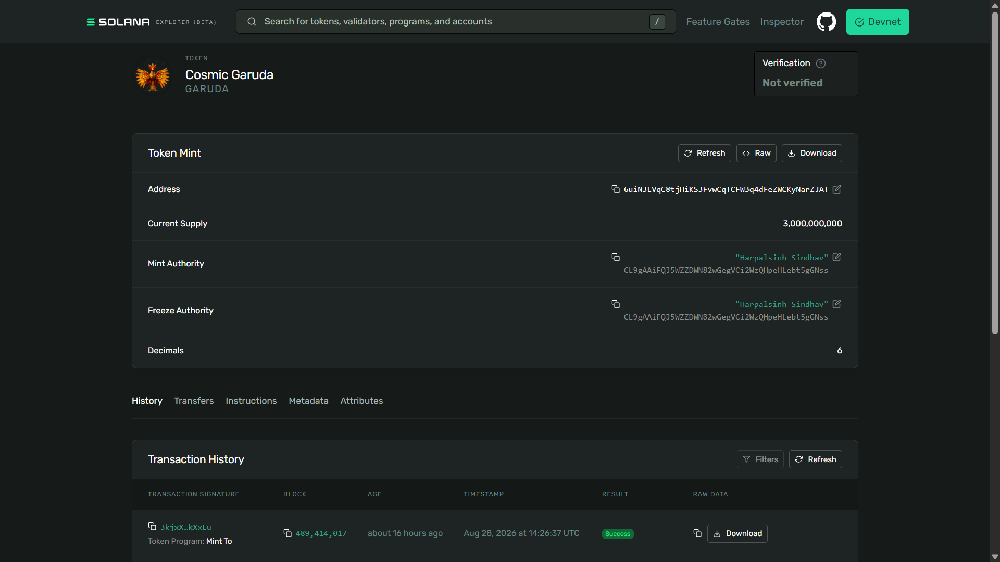
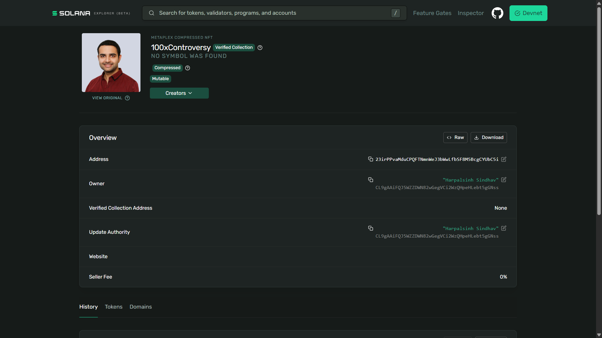
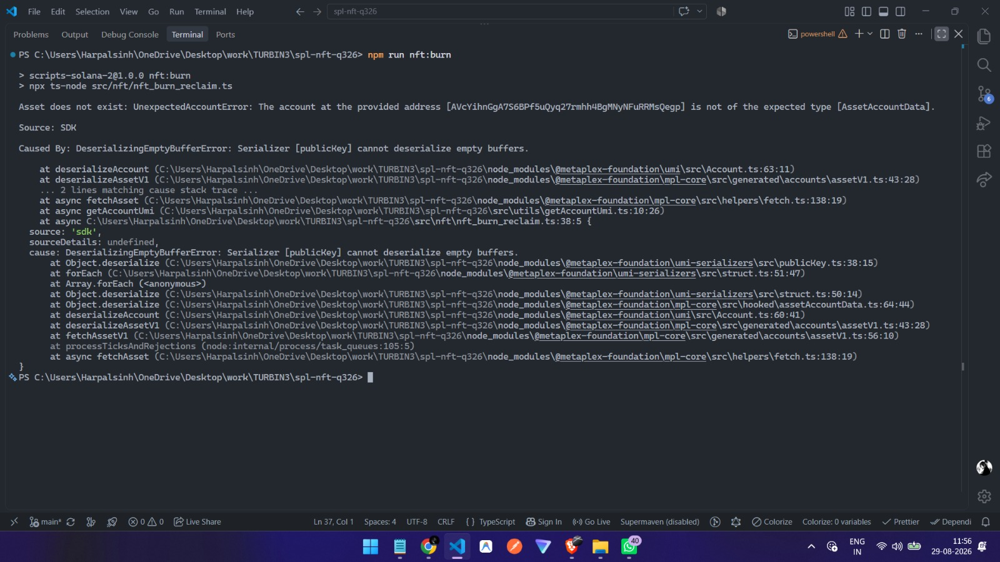

# Solana SPL Token & Metaplex Core NFT Suite

A clean TypeScript toolkit for managing the end-to-end lifecycle of **SPL Tokens** and **Metaplex Core NFTs** on Solana Devnet using `@solana/kit`, `@solana-program/token`, and Metaplex UMI (`mpl-core`, `mpl-token-metadata`, Irys).

---

## 📁 Project Structure

```text
├── assets/                       # Proof screenshots & media assets
│   ├── 100xKirat.jpeg            # NFT source artwork
│   ├── cosmic-garuda.json        # NFT metadata JSON
│   ├── cosmic-garuda.png         # NFT source image
│   ├── spl_token_metadata.png    # SPL Token explorer verification
│   ├── nft_mint_update.png       # Metaplex Core NFT explorer verification
│   └── nft_burn_success.jpeg     # Burn execution & rent reclaim proof
├── src/
│   ├── spl/                      # SPL Token scripts (@solana/kit + mpl-token-metadata)
│   │   ├── spl_init.ts           # Initialize token mint account
│   │   ├── spl_metadata.ts       # Attach token metadata (name, symbol)
│   │   ├── spl_mint.ts           # Create ATA and mint supply
│   │   └── spl_transfer.ts       # Transfer tokens between ATAs
│   ├── nft/                      # Metaplex Core NFT scripts (mpl-core + UMI + Irys)
│   │   ├── nft_image.ts          # Upload image asset to Irys
│   │   ├── nft_metadata.ts       # Upload metadata JSON to Irys
│   │   ├── nft_mint.ts           # Mint Metaplex Core NFT
│   │   ├── nft_ownership_transfer.ts # Transfer NFT ownership
│   │   ├── nft_update_metadata.ts    # Update metadata & authority
│   │   └── nft_burn_reclaim.ts       # Burn NFT & reclaim rent
│   └── utils/
│       └── getAccountUmi.ts      # UMI instance and keypair helper
├── devnet-wallet.json            # Devnet keypair (gitignored)
├── package.json
└── tsconfig.json
```

---

## 🚀 Quickstart

### 1. Prerequisites & Installation

- **Node.js**: `v18+`
- Place your Solana Devnet wallet keypair at the project root as `devnet-wallet.json`:
  ```json
  [174, 23, 145, 92, ...]
  ```

Install dependencies:
```bash
npm install
```

---

## 🛠️ Usage Guide

### 1. SPL Token Lifecycle

Execute in sequential order:

| Step | Command | Description |
| :--- | :--- | :--- |
| **1. Initialize Mint** | `npm run spl:init` | Creates a new SPL Token Mint account (6 decimals). |
| **2. Add Metadata** | `npm run spl:metadata` | Sets token name, symbol, and URI via Metaplex Token Metadata. |
| **3. Mint Tokens** | `npm run spl:mint` | Derives ATA idempotently and mints initial token supply. |
| **4. Transfer Tokens** | `npm run spl:transfer` | Performs checked transfer of tokens to a recipient ATA. |

---

### 2. Metaplex Core NFT Lifecycle

Execute in sequential order:

| Step | Command | Description |
| :--- | :--- | :--- |
| **1. Upload Image** | `npm run nft:image` | Uploads local image asset to decentralized Irys storage. |
| **2. Upload Metadata** | `npm run nft:metadata` | Uploads Metaplex Core standard metadata JSON to Irys. |
| **3. Mint NFT** | `npm run nft:mint` | Mints single-account Metaplex Core NFT on-chain. |
| **4. Transfer NFT** | `npm run nft:transfer` | Transfers NFT asset ownership to a new wallet address. |
| **5. Update NFT** | `npm run nft:updateMetadata` | Updates NFT name/URI and delegates/transfers update authority. |
| **6. Burn NFT** | `npm run nft:burn` | Permanently destroys the NFT asset and reclaims rent lamports. |

---

## 📸 Proof of Execution

### SPL Token Mint & Metadata Verification
Token mint initialized with on-chain metadata, decimals, and token supply verified on Solana Devnet:



---

### Metaplex Core NFT Mint & Update Verification
Metaplex Core NFT minted and updated on Devnet with decentralized metadata and asset parameters:



---

### NFT Burn & Rent Reclaim Validation
Terminal execution demonstrating NFT burn lifecycle and asset state verification:



---

## 🧰 Tech Stack

- **Solana SDK**: [`@solana/kit`](https://www.solanakit.com/) `v6.8.0`
- **Token Program**: [`@solana-program/token`](https://github.com/solana-labs/solana-program-token)
- **NFT Standard**: Metaplex Core ([`@metaplex-foundation/mpl-core`](https://developers.metaplex.com/core))
- **Metadata**: Metaplex Token Metadata ([`@metaplex-foundation/mpl-token-metadata`](https://developers.metaplex.com/token-metadata))
- **Framework & Storage**: Metaplex UMI + Irys Storage ([`@metaplex-foundation/umi-uploader-irys`](https://irys.xyz/))
- **Language**: TypeScript (`ts-node`)

---

## 👤 Author & Submission

Submission of **Week 1 Assignment (SPL and NFT)** by **Harpalsinh Sindhav**
- **GitHub**: [github.com/harpalll](https://github.com/harpalll)
- **X (Twitter)**: [@harpalll_dev](https://x.com/harpalll_dev)
